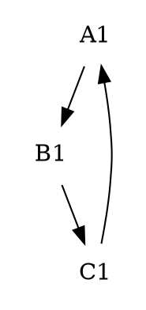
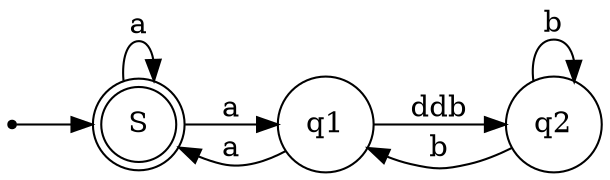
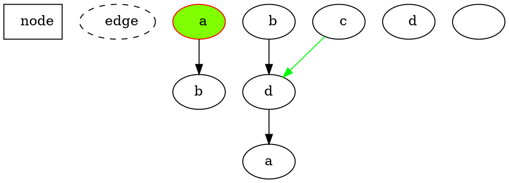
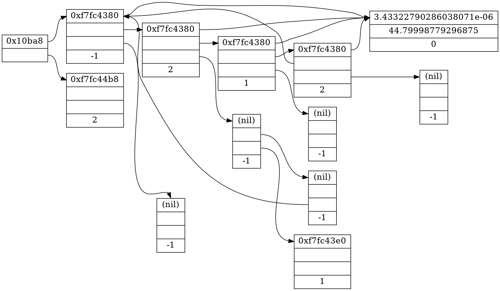

# test1

## test2

### test3

## test22

- [x] to do something


```graphviz
digraph g {      
    node [shape=plaintext]
    A1 -> B1
    B1 -> C1
    C1 -> A1
}
```

$$a^2 = b^2 + c^2$$

# test


```graphviz
digraph finite_state_machine {
    rankdir=LR;
    size="8,5"

    node [shape = doublecircle]; S;
    node [shape = point ]; qi

    node [shape = circle];
    qi -> S;
    S  -> q1 [ label = "a" ];
    S  -> S  [ label = "a" ];
    q1 -> S  [ label = "a" ];
    q1 -> q2 [ label = "ddb" ];
    q2 -> q1 [ label = "b" ];
    q2 -> q2 [ label = "b" ];
}
```

# test


```graphviz
digraph 1{
  node[shape="record"];
  edge[style="dashed"];
  a[style="filled",color="red",fillcolor="chartreuse"];
  b;
  c;
  d;
  a ->b;
  b ->d;
  c ->d[color="green"];
  d-> a;
}
```

# test

```
brew install graphviz
dot -Tpng test.dot -o test.png
```


```graphviz
digraph g {
graph [
rankdir = "LR"
];
node [
fontsize = "16"
shape = "ellipse"
];
edge [
];
"node0" [
label = "<f0> 0x10ba8| <f1>"
shape = "record"
];
"node1" [
label = "<f0> 0xf7fc4380| <f1> | <f2> |-1"
shape = "record"
];
"node2" [
label = "<f0> 0xf7fc44b8| | |2"
shape = "record"
];
"node3" [
label = "<f0> 3.43322790286038071e-06|44.79998779296875|0"
shape = "record"
];
"node4" [
label = "<f0> 0xf7fc4380| <f1> | <f2> |2"
shape = "record"
];
"node5" [
label = "<f0> (nil)| | |-1"
shape = "record"
];
"node6" [
label = "<f0> 0xf7fc4380| <f1> | <f2> |1"
shape = "record"
];
"node7" [
label = "<f0> 0xf7fc4380| <f1> | <f2> |2"
shape = "record"
];
"node8" [
label = "<f0> (nil)| | |-1"
shape = "record"
];
"node9" [
label = "<f0> (nil)| | |-1"
shape = "record"
];
"node10" [
label = "<f0> (nil)| <f1> | <f2> |-1"
shape = "record"
];
"node11" [
label = "<f0> (nil)| <f1> | <f2> |-1"
shape = "record"
];
"node12" [
label = "<f0> 0xf7fc43e0| | |1"
shape = "record"
];
"node0":f0 -> "node1":f0 [
id = 0
];
"node0":f1 -> "node2":f0 [
id = 1
];
"node1":f0 -> "node3":f0 [
id = 2
];
"node1":f1 -> "node4":f0 [
id = 3
];
"node1":f2 -> "node5":f0 [
id = 4
];
"node4":f0 -> "node3":f0 [
id = 5
];
"node4":f1 -> "node6":f0 [
id = 6
];
"node4":f2 -> "node10":f0 [
id = 7
];
"node6":f0 -> "node3":f0 [
id = 8
];
"node6":f1 -> "node7":f0 [
id = 9
];
"node6":f2 -> "node9":f0 [
id = 10
];
"node7":f0 -> "node3":f0 [
id = 11
];
"node7":f1 -> "node1":f0 [
id = 12
];
"node7":f2 -> "node8":f0 [
id = 13
];
"node10":f1 -> "node11":f0 [
id = 14
];
"node10":f2 -> "node12":f0 [
id = 15
];
"node11":f2 -> "node1":f0 [
id = 16
];
}
```